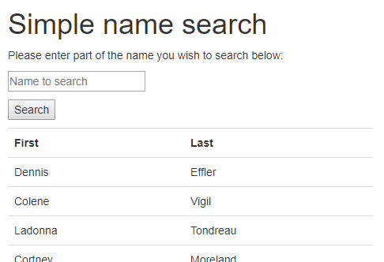
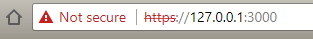

# Dont Panic
This is not a test, well actually it is but lets run with it.

This MangoDB, Express API search function queries a back end database for names. Below are the setup and install instructions for running this sample code application. Application written in AngularJS, Bootstrap with REST API. 

<br>
## Test Environment

The host OS for the purpose of testing wast Windows 10 x64 and the setup instructions below are for this host only but can easily be run under UNIX/ Linux or OS X.

Instaled components
* [MongoDB Community](https://www.mongodb.com/download-center#community) Server (3.6.5)
* [MongoDB Community](https://www.mongodb.com/download-center#community) Stable Edition (1.13.1)
* [Node.js](https://nodejs.org/en/download/) (8.11.1)
> NOTE: When installing MongoDB Community Server under Windows 10 you may get an error installing Compass. Deselect Compass and reinstall. Use the stand alone installer to install Compass to resolve this issue.

### Node.JS and MongoDB setup
To setup the server under Windows 10 first create the database directory the run ther server:
```
md \data\db
"C:\Program Files\MongoDB\Server\3.6\bin\mongod.exe"
```
All other dependancies are described in [package.json](./package.json). All front end depandancies are also instaled using bowser.
```
npm install
```
To setup the default database of 50 names (created using http://listofrandomnames.com/) run the test script below. You can replace the list with your own or add names to the list as required see [names.txt](./names.txt).
```
npm test
```
> NOTE: MongoDB is assumed to be running on the localhost and at this point is unsecured if the SECURE var is not set to 1.

Application can now be started by typing:
```
npm start
```
To launch the application [https://localhost:3000](https://localhost:3000).

To view the full list of names go to [https://localhost:3000/api](https://localhost:3000/api).
### API
JSON data is accessible via a simple API:
- https://localhost:3000/api returns all names in the database
- https://localhost:3000/api?search=Joe returns filters names in the database

## Todo List
Features not yet implemented are marked with a TODO in the code. These include:
- [x] Check index.html against https://validator.w3.org
- [x] Allow partial name matches in application
- [ ] Secure the mongoDB and AngularJS connection (Authentication and Authorization).
- [x] Encrypt connection data https.
- [x] Update the backend to use Express as per the requirement
- [ ] Add inline documentation into comments ([jsdoc](https://www.npmjs.com/package/jsdoc)) and test documentation generation (incomplete)
- [ ] Switch AngularJS implementation to Angular 2+ as per the requirement
- [ ] Wrap the search functions in a module class with reusable methods along with other functions that are generic and re-usable.
- [ ] Add opertions to modify / delete data.
- [ ] Consider CI/CT with automated testing (Karma, Jasmine).
- [ ] Add AJAX icon when loading data

## Comments
AngularJS was used in this example as switching to Angular 2+ would have increased the development time as I am not familiar with newer releases of the Angular framework. 

Inital implementation did not use the express framework again due to lack of familiarity. Prototyping the code using http-server was more familiar and could be switched out later. Getting the MongoDB API functioning was deemed the highest priority so this was the feature that I focused on first.

Some importance was placed on the front end. Bootstrap was used to provide a simple clean interface and to present the clean table or results post search.

Returning the data is slow. Consider loading all the data then using AngulkarJS filter to update the view with the search results.

## Notes
There are a couple of vars that change the behaviuor of the server there are :
* DEBUG - enable debug logging (DEBUG=0)
* SECURE - create https encrypted server (SECURE=1)
> NOTE : A test certificate and key is provided for the purposes of testing but is not from a recogniced certificate authority. Create your own certiicated for testing in Cygwin using the command 'openssl req -newkey rsa:2048 -nodes -keyout domain.key -x509 -days 365 -out domain.crt'. In production this will need to be replaced.

<br>
Google chrome will reject the certificate you can override this to work with the temporary certificate.
